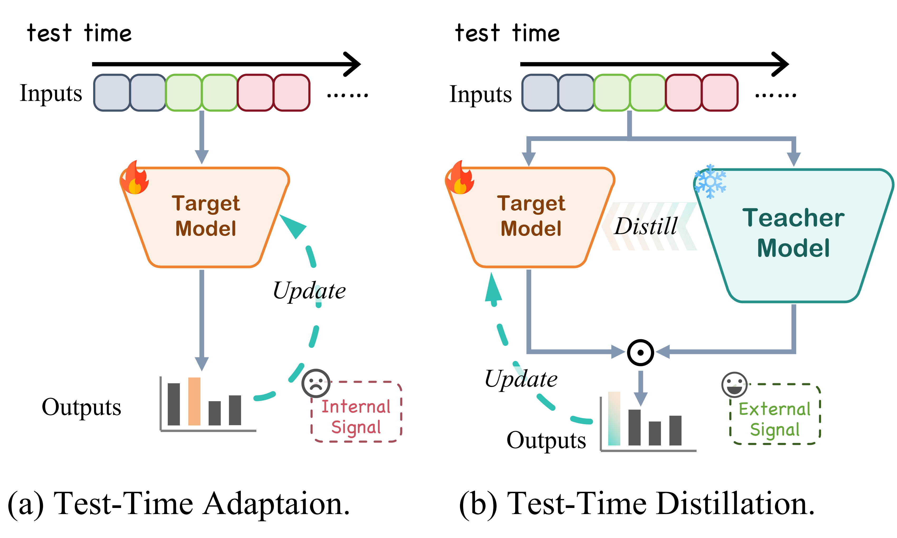
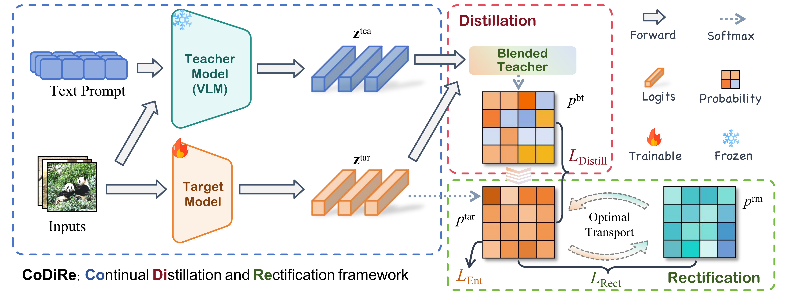
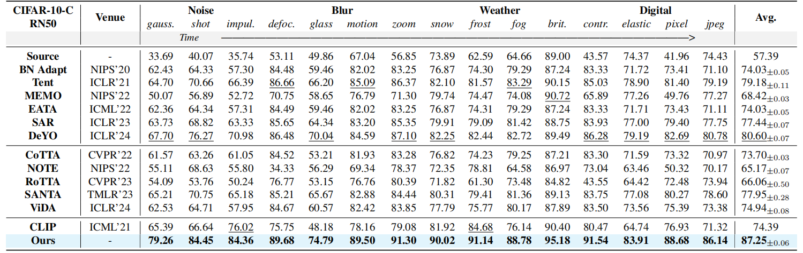
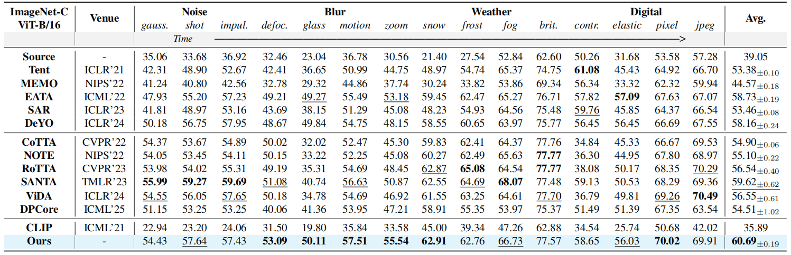
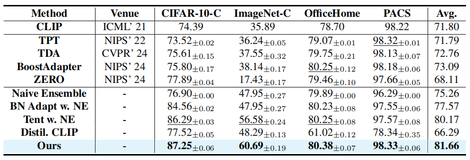
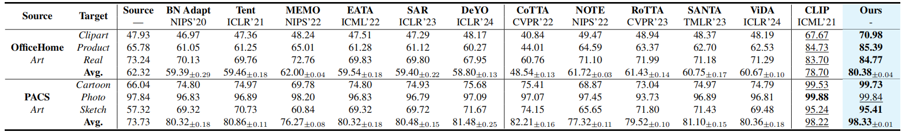

# Test-Time Distillation for Continual Model Adaptation

<p align="center">
  <a href="https://github.com/walawalagoose/TTD">
    
  </a>
  <a href="https://github.com/walawalagoose/TTD">
    
  </a>
  <a href="https://arxiv.org/abs/2506.02671">
    
  </a>
</p>

This is the official repository of our paper: [Test-Time Distillation for Continual Model Adaptation](https://arxiv.org/abs/2506.02671), accepted by CVPR 2026 Findings.

## Overview
Continual Test-Time Adaptation (CTTA) usually learns from the target model's own predictions, which can amplify early mistakes under severe distribution shifts. We propose **Test-Time Distillation (TTD)**: instead of relying only on this internal signal, the target model adapts with an external signal from a frozen Vision-Language Model (VLM). Our method, **CoDiRe** (**Co**ntinual **Di**stillation and **Re**ctification), builds a robust blended teacher from the VLM and target model, then uses distillation and optimal-transport-based rectification for stable continual adaptation.

<p align="center">
  
</p>

<details>
  <summary><strong>Abstract</strong></summary>

Deep neural networks often suffer performance degradation upon deployment due to distribution shifts. Continual Test-Time Adaptation (CTTA) aims to address this issue in an unsupervised manner. However, existing methods that rely on self-supervision are prone to an inherent self-referential feedback loop that amplifies initial prediction errors, leading to model drift. We revisit this limitation and propose Test-Time Distillation (TTD), which reframes adaptation as a distillation process guided by a frozen Vision-Language Model (VLM) as an external signal. While promising, direct distillation suffers from the Generalist Trap and Entropy Bias. To address these pitfalls, we present CoDiRe, a Continual Distillation and Rectification framework for TTD. CoDiRe constructs a robust blended teacher by dynamically fusing the predictions of the VLM and the target model with Maximum Softmax Probability (MSP), then applies Optimal Transport-based rectification to enable continuous and stable adaptation.
</details>

## Method

CoDiRe has three main ingredients:

- **External supervision:** a frozen CLIP/VLM teacher provides an independent signal during inference, helping avoid the self-referential feedback loop of conventional CTTA.
- **Continual distillation:** the VLM and target model are fused into a blended teacher using MSP-based confidence, avoiding entropy-biased fusion across heterogeneous models.
- **Rectification:** optimal transport refines the target prediction distribution, and a domain-switch detector selectively resets normalization layers to improve continual stability.

For **continual** streams, this repository supports periodic domain-wise logging. CTTA runs can therefore report both the overall performance and each domain's individual performance along the stream.

<p align="center">
  
</p>

## Main Results

CoDiRe is evaluated on various common-corruption (CIFAR-10-C, CIFAR-100-C, and ImageNet-C) and domain generalization benchmarks (PACS and OfficeHome). On ImageNet-C, CoDiRe outperforms CoTTA by **10.55%** while using only **48%** of its time cost. It also compares favorably with VLM-based TTA and simple TTD methods, showing that using a VLM as a carefully blended teacher is more reliable than directly trusting the VLM or naively fusing predictions.

<p align="center">
  
</p>

<p align="center">
  
</p>

<p align="center">
  
</p>

<p align="center">
  
</p>

## Run

### Installation

We recommend creating a fresh conda environment:

```bash
git clone https://github.com/walawalagoose/TTD.git
cd TTD

conda create -n ttd python=3.10 -y
conda activate ttd
pip install -r requirements.txt
```

CoDiRe uses CLIP as the frozen VLM teacher. CLIP weights are downloaded automatically to `~/.cache/clip` when first used. You can select the teacher backbone with `--clip_arch`, for example `RN50`, `ViT-B/16`, or `ViT-L/14`.

### Datasets and Checkpoints

Prepare datasets under `--data_path`. The expected layout is:

```text
data_path/
├── cifar10/
├── cifar10_c/
│   ├── gaussian_noise.npy
│   ├── shot_noise.npy
│   └── ...
├── cifar100/
├── cifar100_c/
├── imagenet/
├── imagenet-c/
│   └── gaussian_noise/5/...
├── officehome/
│   ├── art/
│   ├── clipart/
│   ├── product/
│   └── realworld/
└── pacs/
    ├── art/
    ├── cartoon/
    ├── photo/
    └── sketch/
```

Prepare source-pretrained checkpoints under `pretrained_ckpts/` or pass the checkpoint explicitly with `--ckpt_path`. 

We provide a [pretrained checkpoints](https://drive.google.com/file/d/1OixIIEx9BoSoUvs7HAq4KX-bg53aJ94_/view?usp=sharing) here. These checkpoints were pretrained on the in-distribution datasets by self-supervised learning with a rotation prediction task.

Example paths used by the experiment files include:

```text
pretrained_ckpts/
├── cifar10/rn50_bn_cifar10.pth
├── cifar100/rn50_bn_cifar100.pth
├── imagenet/rn50_bn_imagenet.pth
├── officehome/resnet50_bn_ssh_art_of.pth
└── pacs/resnet50_bn_ssh_art_pacs.pth
```

### Single Experiment

You can run CoDiRe directly through `run_exp.py`. The following example evaluates CIFAR-10-C in the continual setting:

```bash
python run_exp.py \
  --model_adaptation_method codire \
  --model_selection_method last_iterate \
  --base_data_name cifar10 \
  --src_data_name cifar10 \
  --data_names "cifar10_c_deterministic-gaussian_noise-5;cifar10_c_deterministic-shot_noise-5;cifar10_c_deterministic-impulse_noise-5;cifar10_c_deterministic-defocus_blur-5;cifar10_c_deterministic-glass_blur-5;cifar10_c_deterministic-motion_blur-5;cifar10_c_deterministic-zoom_blur-5;cifar10_c_deterministic-snow-5;cifar10_c_deterministic-frost-5;cifar10_c_deterministic-fog-5;cifar10_c_deterministic-brightness-5;cifar10_c_deterministic-contrast-5;cifar10_c_deterministic-elastic_transform-5;cifar10_c_deterministic-pixelate-5;cifar10_c_deterministic-jpeg_compression-5" \
  --model_name resnet50 \
  --data_path ../dataset \
  --ckpt_path ./pretrained_ckpts/cifar10/rn50_bn_cifar10.pth \
  --batch_size 64 \
  --lr 1e-4 \
  --n_train_steps 1 \
  --episodic false \
  --inter_domain HomogeneousNoMixture \
  --record_preadapted_perf true \
  --device cuda:0
```

For ImageNet-C, use `--base_data_name imagenet`, set `--data_names` to the ImageNet-C corruption sequence, and point `--data_path` to the directory containing `imagenet/` and `imagenet-c/`.

### CTTA vs. TTA Configuration

The most important configuration field is `data_names`:

- **CTTA / continual stream:** put multiple domains in **one string**, connected by semicolons. The model adapts continuously from the first domain to the next one without restarting the run.

```python
data_names=[
    "cifar10_c_deterministic-gaussian_noise-5;cifar10_c_deterministic-shot_noise-5;cifar10_c_deterministic-impulse_noise-5",
]
```

- **Standard TTA / independent domains:** put each domain as a separate string in the Python list. `run_exps.py` will expand them into separate runs, so each domain is evaluated independently. If you use `run_exp.py` directly, launch one command per domain.

```python
data_names=[
    "cifar10_c_deterministic-gaussian_noise-5",
    "cifar10_c_deterministic-shot_noise-5",
    "cifar10_c_deterministic-impulse_noise-5",
]
```

For CTTA runs, domain-wise results are logged when the stream preserves domain boundaries, i.e., `cross_domain_batch_shuffle=false` and `inter_domain` is `HomogeneousNoMixture` or `HeterogeneousNoMixture`. In the logs, these entries are tagged as `type=periodic` and also saved as `[Periodic Stats]` text lines, while the full-stream result is tagged as `type=overall`.

### Reproduce Paper-Style Runs

Experiment templates are provided in `exps/`. Each file defines a `NewConf.to_be_replaced` dictionary, and `run_exps.py` expands the grid and launches jobs through the bundled tmux-based launcher.

```bash
python run_exps.py --script_path exps/cifar10c_rn50bn_ctta.py --num_jobs_per_node 2
python run_exps.py --script_path exps/cifar100c_rn50bn_ctta.py --num_jobs_per_node 2
python run_exps.py --script_path exps/imagenet-c_rn50bn_ctta.py --num_jobs_per_node 2
python run_exps.py --script_path exps/pacs_art_rn50bn_ctta.py --num_jobs_per_node 2
python run_exps.py --script_path exps/officehome_art_rn50bn_ctta.py --num_jobs_per_node 2
```

Before launching a grid, edit the corresponding file to match your machine:

- `python_path`: Python executable of your environment.
- `data_path`: dataset root.
- `ckpt_path`: source checkpoint.
- `device`: available GPUs.
- `model_adaptation_method`: use `codire` for our method; uncomment other methods for baseline comparisons.

Logs and metrics are written under `logs/` by default. The output directory can be changed with `--root_path`.

To summarize generated logs, run:

```bash
python run_extract.py --in_dir logs/<your_log_dir>
```

## Code Pointers

- `ttab/model_adaptation/codire.py`: CoDiRe implementation.
- `ttab/model_adaptation/clip_ori/`: CLIP/VLM wrappers and prompt utilities.
- `exps/`: reproducible CTTA experiment templates.
- `run_exp.py`: single-run entry point.
- `run_exps.py`: grid launcher for experiment configs in `exps/`.

## Citation

If you find this repository useful, please consider citing our paper:

```bibtex
@article{chen2025test,
  title={Test-Time Distillation for Continual Model Adaptation},
  author={Chen*, Xiao and Huang*, Jiazhen and Liu, Zhiming and Jiang, Qinting and Huang, Fanding and Jiang, Jingyan and Wang, Zhi},
  journal={arXiv preprint arXiv:2506.02671},
  year={2025}
}
```

## Acknowledgment

This repository builds on prior open-source test-time adaptation codebases. We thank the community for making reproducible research easier.
